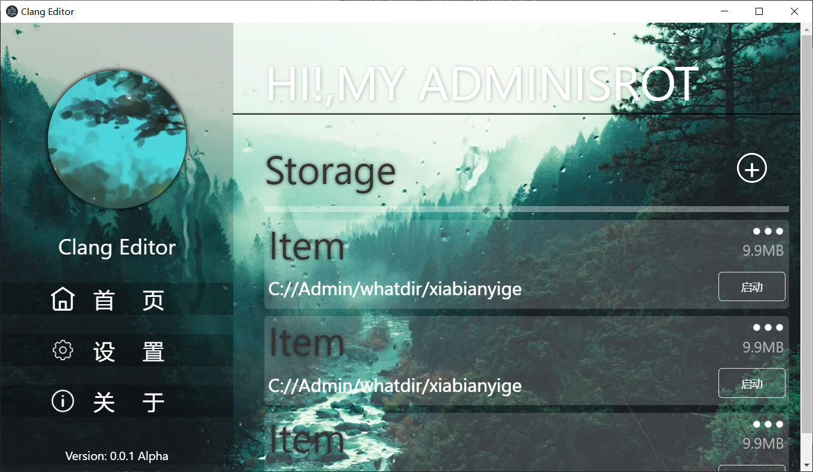

Clang-Editor
===
项目预览图：

## 👇开发技术栈

 - UI框架：[UIKIT](https://getuikit.com/)
 - 程序框架：[Electron](https://www.electronjs.org/) （*v8.8.1）
 - 语言：Javascript([Node.js](http://nodejs.cn/))
 - Javascript框架：[Vue.js](https://cn.vuejs.org/index.html)

## 💻代码维护风格

 - 为避免歧义，请务必在每条Javascript语句最后以';'结尾
 - 提交PR时，将📂dist以及📂node_modules添加至.gitignore文件内
  

## ❓FAQ常见问题
Q:**使用electron-builder生成安装文件时产生’status code 404错误‘**
> A: 可能electron被装在了全局或者没有安装。于是就在源镜像上下载electron，但是淘宝把镜像搞砸了，所以请在cmd里配置以下环境变量
> 
> ELECTRON_MIRROR="https://npm.taobao.org/mirrors/electron/" ELECTRON_CUSTOM_DIR="8.1.1" npm install

## ❗ 注释
因开发初期没有良好的开发习惯（(\*/ω＼\*)），导致项目内文件特别乱，所以请忽略*\\.png|mp4文件。但也不要删除他们，等有时间会考虑整理项目结构
 